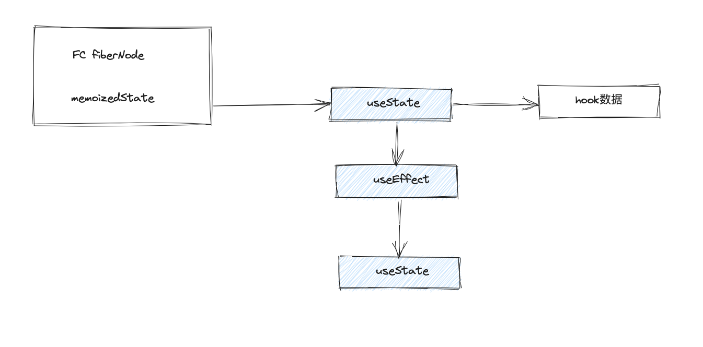

# FunctionComponent

FunctionComponent需要考虑的问题:
+ 如何像支持`HostRoot`, `HostComponent` 以及 `HostText` 一样支持`FC`
+ 如何在FC内部组织Hooks这样的逻辑

## 如何支持FC？
FC的工作同样根植于:
+ beginWork
+ completeWork

## 第二种调试方式

采用vite的实时调试, 好处是可以实时看到源码的运行效果

> 但是对于实际项目中的运行, 不如构建调试, 可能会产生一些差异性

## useState

> hooks是不能脱离FC上下文的, 一旦脱离他们仅仅只是个普通函数, 因此他们需要上下文的感知能力

### 感知上下文

比如说
+ hook如何知道在另一个hook的上下文环境内执行?
```tsx
function App() {
  useEffect(() => {
    const [state] = useState(0)
  })
}
```
+ hook怎么知道当前是在mount还是在update?

#### 方案

在不同上下文中调用的hook不是同一个函数

意味着对于不同的生成周期阶段, 需要实现不同的hooks集合

比如说在mount时, 有一个集合包含了所有的hooks, 而更新阶段, 又有另一个集合, 同样包含所有的hooks, 他们只是名字一样罢了

而这些hook的调用, 都是通过 `Reconciler` 来调度的

但实际上useState来自于React包, 因此我们需要跨越Reconciler, 最终到达react

因此需要在不同包之间共享context, 因此需要有一个`内部数据共享层`, 在这里实现`当前阶段使用的hooks集合`

当reconciler执行时, 在不同时期就可以将`当前使用的hooks集合`指向`当前时期的hooks集合`, 实现不同时期使用不同hooks

而在 `react` 中实际调用的, 也就是当前时期的 `hooks`集合, 而非单一的 `hooks实现`

## 数据共享层(currentDispatcher)

### react/src/index
```ts
// 数据共享层
export const __SECRET_INTERNALS_DO_NOT_USE_OR_YOU_WILL_BE_FIRED = {
	currentDispatcher
};
```

### shared -> internals

```ts
// shared中增加internals.ts
import * as React from 'react';

// 引入shared -> internals, 实际上就引入的 React中的数据中转层
const internals = React.__SECRET_INTERNALS_DO_NOT_USE_OR_YOU_WILL_BE_FIRED;

export default internals;
```
以浏览器举例,  Reconciler + hostConfig = ReactDOM

增加 `内部数据共享层`, 意味着Reconciler与React产生关联, 进而意味着ReactDOM与React产生关联

如果两个包`产生关联`。在打包时需要考虑: 两者的代码是打包到一起还是分开呢？

如果打包到一起, 意味着打包后的ReactDOM中会包含React的代码, 那么ReactDOM中会包含一个内部数据共享层, React中也会包含一个内部数据共享层

同事这两个共享层并不是同一个

但是我们希望的是共享数据, 因此不希望ReactDOM中也包含React的代码

### Hooks如何知道自身的数据保存在哪里?

```tsx
function App() {
  const [num] = useState(0);
  return <div>{num}</div>
}
```

其实可以记录当前正在render的FC对应的fiberNode, 在fiberNode上保存hook的状态数据



这里的 `fiberNode.memoized`指向的是一个 `hooks链表`, 初始状态指向链表中的第一个 hook, 而链表中的hook, 通过一个`next`指针指向下一个需要处理的hook

这也是为什么 React 官方文档强调Hook的调用顺序不能变的原因, 因为它最终是以一个链表来保存Hook的数据, 因此每次更新时调用顺序要保持一致, 才能通过memoizedState取到对应hook的数据

### Hook数据结构

> 这个数据结构要能够满足所有Hook的使用, 并不仅仅是useState


## update增加优先级调度(schedule阶段)
