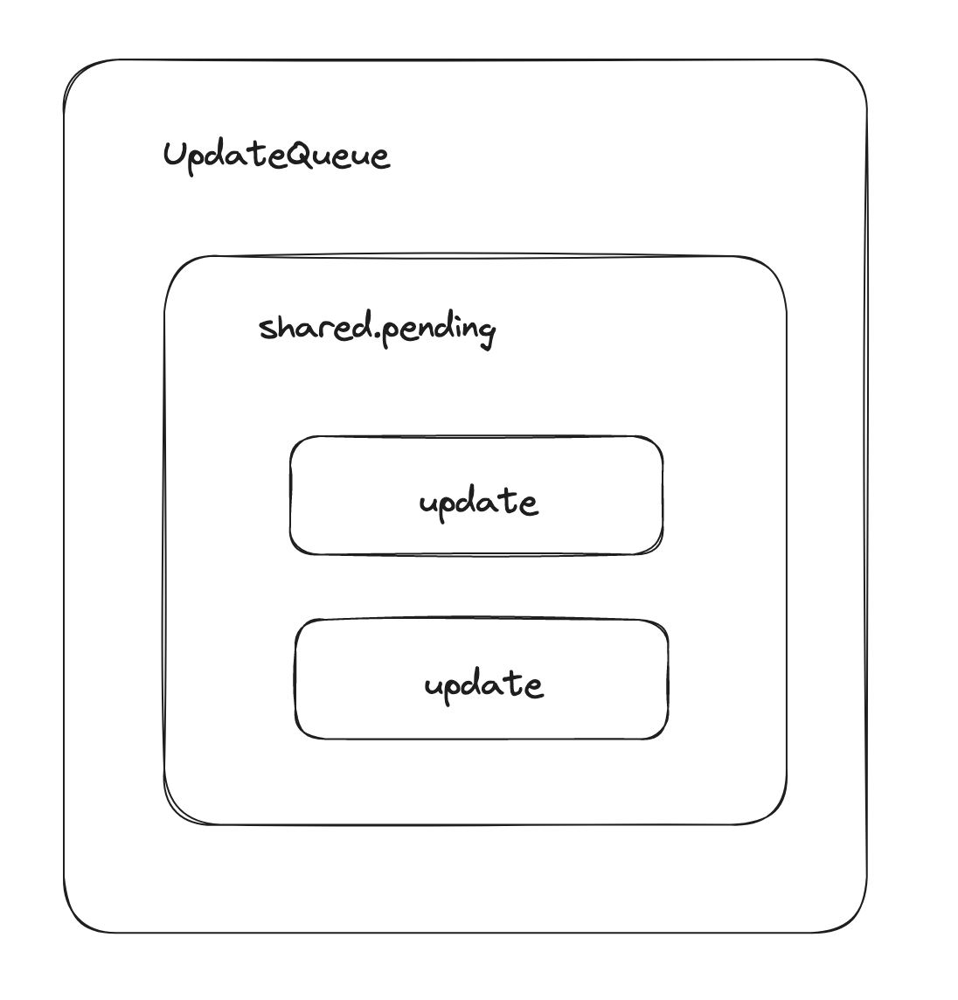

# 如何触发更新

## 常见的触发更新的方式

> 其实就是调用 renderRoot 的方法

- `ReactDOM.createRoot().render(或者ReactDOM.render)`
- `this.setState`
- `useState的dispatch方法`

更新的入口略多, 我们希望能有一套统一的更新机制, 具有如下特点:

- 兼容上述所有更新的方式
- 方便后续扩展(优先级机制...)

### renderRoot 实现

```ts
// renderRoot 主要用于开启更新
// 调用 renderRoot 应当是触发更新的API
function renderRoot(root: FiberRootNode) {
	// 初始化, 让 workInProgress 指向第一个遍历的FiberNode
	// ? 深度优先(先序遍历), 把root丢进去初始化
	prepareRefreshStack(root);
	// 进行首次循环
	do {
		try {
			workLoop();
			break;
		} catch (e) {
			console.error('workLoop发生错误:', e);
			// 有报错就重置 workInProgress
			workInProgress = null;
		}
	} while (true);

	// workLoop完成后, 这里就可以得到一颗新创建的FiberNode Tree
	// ? 这棵树在 root.current.alternate 上
	// ? root是 fiberRootNode, 他的current指向 hostRootFiber
	// ? 他的 alternate 是整个更新开始时, 也就是在 prepareRefreshStack 中创建的 wip
	// ? 此时 wip 已经处理完成了
	const finishedWork = root.current.alternate;
	root.finishedWork = finishedWork;

	// 根据 wip fiberNode 树中的flags执行首屏渲染操作
	commitRoot(root);
}
```

## 更新机制的组成

- 代表更新的数据结构 -- Update
- 消费 update 的数据结构 UpdateQueue(更新队列)

> 一个 UpdateQueue 包含 shared.pending
>
> 这个 pending 指向的就是 update



### Update

```ts
// Update数据结构
export interface Update<State> {
	// 触发更新的函数
	action: Action<State>;
}

// 由于setState, 包含两种参数形式, 一个是最新的状态, 一个是更新函数(返回状态最新值)
// 这里的Action就对应了两种setState的调用形式
export type Action<State> = State | ((prevState: State) => State);

export interface UpdateQueue<State> {
	shared: {
		pending: Update<State> | null;
	};
}
```

### CreateUpdate

> 用于创建 Update 实例

```ts
const createUpdate = <T>(action: Action<T>): Update<T> => {
	return {
		action
	};
};
```

### CreateUpdateQueue

> 初始化 UpdateQueue 实例

```ts
const createUpdateQueue = <State>(): UpdateQueue<State> => {
	return {
		shared: {
			pending: null
		}
	} as UpdateQueue<State>;
};
```

### enqueueUpdate

> 向 UpdateQueue 中增加 Update

```ts
export const enqueueUpdate = <State>enqueueUpdate(updateQueue: UpdateQueue<State>, update<State>) => {
  // 将当前update实例加入更新队列中
  updateQueue.shared.pending = update;
}
```

### processUpdate

> 用于 UpdateQueue 消费 Update

```ts
// 接收一个初始状态, 以及当前需要消费的Update, 返回消费Update后全新的状态, 也就是 memoizedState
const processUpdateQueue = <State>(
	baseState: State,
	pendingUpdate: Update<State> | null
): { memoizedState: State } => {
	// 设置最终状态, 初始值为当前状态
	const result: ReturnType<typeof processUpdateQueue> = {
		memoizedState: baseState
	};

	if (pendingUpdate !== null) {
		// 1 baseState 1 update 2 -> 最终得到就是 memoizedState 2
		// 2 baseState 1 update (x) => 4 * x -> memoizedState 4
		const action = pendingUpdate.action;
		if (action instanceof Function) {
			result.memoizedState = action(baseState); // setState传递回调函数
		} else {
			result.memoizedState = action;
		}
	}

	return result;
};
```

## 接下来的工作包括

- 实现 mount 时调用的 API
  - 这个在`fiberReconciler`中实现
- 将该 API 接入上述更新机制中

## 需要考虑的事情

- 更新可能发生在任何一个组件, 但是更新的流程总是从根节点开始的
- 需要一个统一的根节点保存通用信息

基于上述两个考虑, react 的每一次更新都需要从当前节点(触发更新的节点)开始, 向上遍历到根节点

```ts
ReactDOM.createRoot(rootElement).render(<App />);
```

执行 `ReactDOM.createRoot(rootElement)` 创建一个 `root`

这个`root`就是当前应用统一的根节点, 叫做 `fiberRootNode`

而传入参数 `rootElement`对应的 DOM, 其对应的 fiber 节点就是 `hostRootFiber`, 是一个 `HostRoot`类型的`fiberNode`

`fiberRootNode`与`hostRootFiber`通过 `current`和`stateNode`指针连接

调用`render(<App />)`最终就生成了 App 对应的`FiberNode`

App 这个 FiberNode 和 hostRootFiber 通过`child`和`return`来连接


## FiberRootNode

> FiberRootNode 实现
>
> 区别于 FiberNode

```ts
// 此处不能写死 hostConfig的路径, 因为 react-reconciler 下的 hostConfig 只是暂时实现
// 后续还需要做更多的扩展
import type { Container } from 'hostConfig';

class FiberRootNode {
	public container: Container; // 保存的就是宿主环境的挂载节点, 也就是rootElement

	// 指向hostRootFiber, 也就是 container这个DOM对应的fiberNode
	public current: FiberNode;

	// 指向更新完成后的 hostRootFiber, 也是一个 fiberNode
	public finishWork: FiberNode | null;

	constructor(container: Container, hostRootFiber: FiberNode) {
		this.container = container;
		this.current = hostRootFiber;

		hostRootFiber.stateNode = this; // 将hostRootFiber于 fiberRootNode 形成绑定, 通过这两个指针
		this.finishWork = null; // 初始化时没有已经更新完成的hostRootFiber
	}
}
```

### Container

对于不同的宿主环境, 这个 Container 的类型是不同的

因此, 需要单独一个 repo, 来存放 Container 的类型定义, 比如新增一个 repo, 叫做 `react-dom`, 存放所有关于宿主环境为 web 的数据结构

那么 Container 就是一个 Element

```ts
export type Container = Element;
```

同时上述引入 Container 时, 也是来自 hostConfig, 他并不是一个写死的路径, 只是一个占位符, 在构建不同宿主环境时, 可以在构建脚本中进行替换

如下`rollup.config.js`

> 针对 react-dom 构建宿主环境

```ts
export default [
  {
    plugins: [
			// rollup中是被插件  @rollup/plugin-alias 实现的
			alias({
				entries: {
					// entries中key对应需要替换的包名
					hostConfig: `${pkgPath}/src/hostConfig.ts`
				}
			}),
			...
		]
  }
]
```

同时调整 tsconfig, 在开发时指向 react-dom 这个 repo, 避免开发阶段 ts 报错

而如果需要将前端逻辑打包到其他宿主环境, 则只需要实现一套类似 web 的 react-dom 即可做到将 react 打包到其他环境中, 比如 ios android harmony 等

```json
{
  "compilerOptions": {
    ...
    "paths": {
      ...
      // 指向react-dom下的hostConfig
      "hostConfig": ["packages/react-dom/src/hostConfig"]
    }
  },
  ...
}
```
