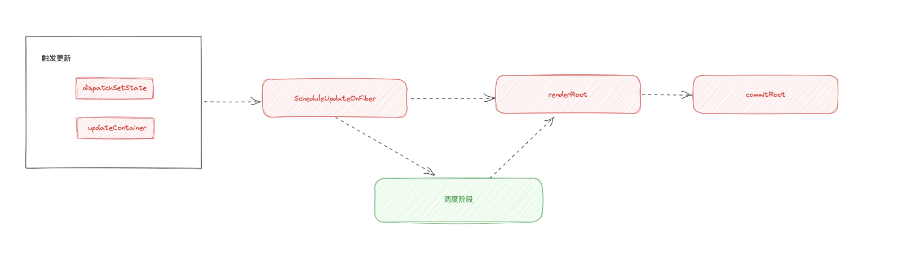

# 实现同步调度流程

## 更新到底是同步还是异步的？

> 这在react18以前, 是一道很经典的面试题。

```tsx
class App extends React.Component {
  onClick() {
    this.setState({ a: 1 });
    console.info(this.state.a);
  }
}
```

## 当前的现状:

+ 从触发更新到render, 再到commit都是同步的
+ 多次触发更新会重复多次更新流程

## 可以改进的点:

多次触发更新, 只进行一次更新流程

主要利用的就是 `Batched Updates(批处理)`, 多次触发更新, 只进行一次更新流程

将多次更新合并为一次, 理念上有点类似防抖、节流, 我们需要考虑合并的时机是:

+ 宏任务?
+ 微任务?

现有如下三个框架
+ React
+ Vue3
+ Svelte

可以看到在React中, 既有宏任务(startTransition), 也有微任务(其他情况)。

```ts
const [isPending, startTransition] = useTransition();
const [count, setCount] = useState(0);

const onClick = () => {
  startTransition(() => {
    setCount(count => count + 1)
    setCount(count => count + 1)
    setCount(count => count + 1)

    console.info(count); // 0
    Promise.resolve().then(() => {
      console.info(count) // 0
    })

    setTimeout(() => {
      console.info(count) // 3
    })
  })
}
```

通过上述例子, 可以知道, 在startTransition中, 并发更新是使用的宏任务, 但是在一般情况下, 是使用的微任务

## 新增调度阶段

既然需要 `多次触发更新, 只尽心过一次更新流程`

意味着需要将更新合并

所以需要在如下两个阶段

+ render阶段
+ commit阶段

基础上增加 schedule 阶段(调度阶段)



## 对update的调整

`多次触发更新, 只进行一次更新流程`中`多次触发更新`意味着对于同一个fiber, 会创建多个update:

```ts
const onClick = () => {
  // 创建3个update
  setCount(count => count + 1)
  setCount(count => count + 1)
  setCount(count => count + 1)
}
```

`多次触发更新, 只进行一次更新流程`, 意味着要达成3个目标

+ 需要实现一套优先级机制, 每个更新都拥有优先级
+ 需要能够合并一个宏任务/微任务中触发的所有更新
+ 需要一套算法, 用于决定哪个优先级优先进入render阶段


## Lane模型


